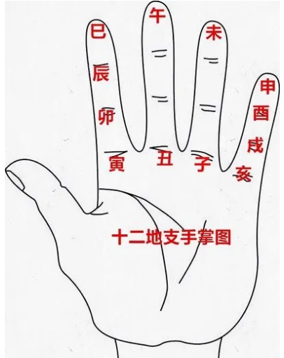

# A5 五虎遁 · 五鼠遁（传统口诀与推算）

学习目标
- 记忆“五虎遁月建”口诀，能由“年干”推算每月的天干（正月为首）。
- 记忆“五鼠遁时”口诀，能由“日干”推算该日首时的天干（以子时为锚点）。
- 熟悉“月支序列”（寅为正月），能按顺序进行正逆推算，应用到练习与考试。
- 逢龙则化：甲己化土（戊），乙庚化金（庚），丙辛化水（壬），丁壬化木，戊癸化火（丙）
- 例如： 甲己年或者甲己日，那么对应的辰月或者辰时的天干必定是戊
- 又如： 戊癸年或者日，那么对应的辰月或者辰时的天干必定是丙
- 熟练地使用左手12地支的掌诀，那么五虎遁和五鼠遁，记忆的量就大大减少，当然熟记五虎遁和五鼠遁会更加快捷！

一、核心口诀
1) 五虎遁（月建起干，年干定正月干）
- 甲己之年丙作首；乙庚之年戊作首；
- 丙辛之年庚作首；丁壬之年壬作首；
- 戊癸之年甲作首。
说明：以上是“正月（农历一月）天干”的起点。之后每月天干依次递增一位（十天干循环）。

2) 五鼠遁（日起时，日干定首时干）
- 甲己之日丙为首；乙庚之日戊为首；
- 丙辛之日庚为首；丁壬之日壬为首；
- 戊癸之日甲为首。
说明：以上是“每日首个时辰（子时）”的天干起点。首时常配“子”为地支（如丙子、戊子、庚子、壬子、甲子）。

二、月支序列（固定）
- 正月为寅、二月为卯、三月为辰、四月为巳、五月为午、六月为未、
- 七月为申、八月为酉、九月为戌、十月为亥、十一月为子、十二月为丑。
说明：月支固定顺序，不随年干改变；推算时“干按口诀起点递增，支按固定序”。

三、推算方法
- 年干 → 正月干：按“五虎遁”查起点（丙/戊/庚/壬/甲之一）。
- 日干 → 首时干：按“五鼠遁”查起点（丙/戊/庚/壬/甲之一）。
- 递增规则：十天干按甲→乙→丙→丁→戊→己→庚→辛→壬→癸循环；
  月序从正月起每月天干加一位，时序从首时起每个时辰天干加一位。

四、例题演示（纠错后）
- 例 1：丁年正月天干？
  - 丁属“丁壬之年壬作首”，故正月干为“壬”；二月干“癸”、三月干“甲”。
- 例 2：辛日首时天干？
  - 辛属“丙辛之日庚为首”，故首时干为“庚”（常配“庚子”为首时）。
- 例 3：戊年五月天干？
  - 戊属“戊癸之年甲作首”，故正月干为“甲”；五月为“甲→乙→丙→丁→戊”（此题为五虎遁的月干推算，不涉及五鼠遁）。

五、学习与练习建议
- 先熟背两条口诀，再配合“月支序列”做正逆练习。
- 口算训练：给定年干/月干，快速说出正月干/首日干与某月/某日的递推结果。
- 错题本：将易混淆的“干起点”与“月支固定序”标注在错题备注中反复复习。

七、十二地支掌诀（手掌定位记忆法）
为便于快速定位地支顺序与相邻关系，可配合传统「十二地支掌诀」记忆图使用。本掌诀用于帮助在十二地支环上“数位移动”，不直接决定天干起点。

使用要点：
- 环走顺序固定：寅 → 卯 → 辰 → 巳 → 午 → 未 → 申 → 酉 → 戌 → 亥 → 子 → 丑（回到寅）。与月支、时支序列一致。
- 快速定位月份（配合五虎遁）：以“寅为正月”，找某月或向前/向后推 N 月，沿掌图顺序移动 N 格；天干仍按五虎遁从“年上起月”推。
- 快速定位时辰（配合五鼠遁）：按五鼠遁由“日干”定首时干后，具体时支顺序与掌图一致；掌图用于支序定位，不替代天干起点。
- 易错提醒：掌图仅反映地支的环状次序与邻近关系，不替代“五虎遁/五鼠遁”的天干起算规则。
- 图片未显示：请将掌诀图片保存为 `yin_yang_wuxing/assets/十二地支掌诀.png`（推荐宽度 400–800px）。

小练习：
- 例 A：从“卯月”向后推 5 个月落在哪一支？解：卯→辰→巳→午→未（5 格），答案“未月”；月干按五虎遁另行推算。
- 例 B：某日已按五鼠遁定首时干，要找“戌时”的序位，可在掌图从“子”起顺排到“戌”定位，再套用已定的时干周期。

六、课程关联
- 练习题库：`quizzes/five_tiger_five_mouse_60.json`（60题，含口诀记忆与按位推算）。
- 考试：在应用“考试”页自动载入本题库（随机顺序、分页展示，统一提交评分）。

> 提示：口诀只定“起点”，后续都按“十天干/十二地支”的固定循环递增。熟练后可直接做“逆推”（往前减一位）。

> 逢龙则化，运用掌诀会方便地统一五虎遁和五鼠遁！